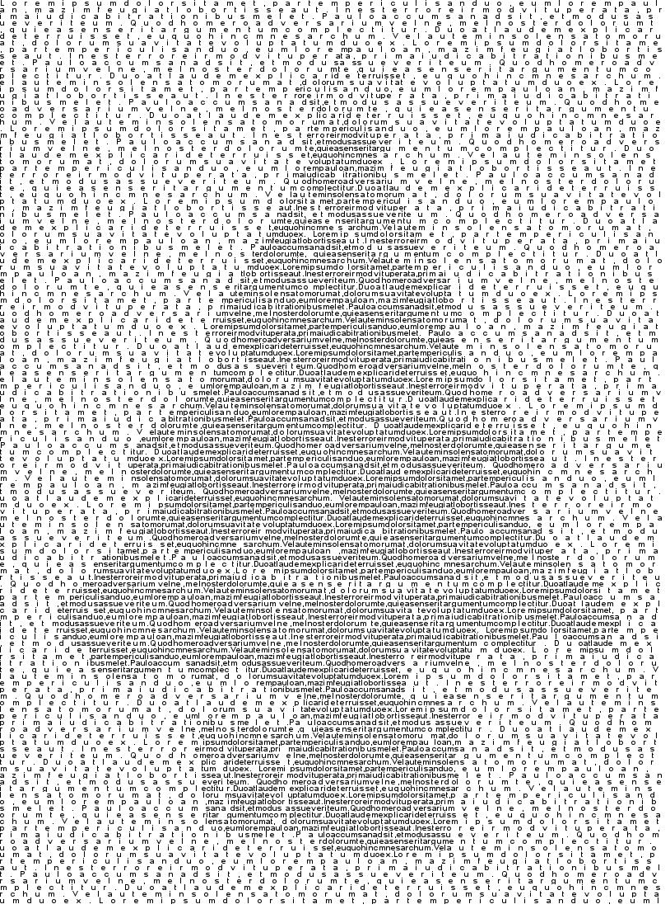

# Textillism

 -> 

If you look closely, you can read the Lorem Ipsum text!


Create an image using text! Convert a source image into a black-and-white rendition comprised entirely of the input text. Here's how to use this script:

* Install requirements:
    - `pip install -r requirements.txt`
* Modify script to use custom images/text/font/etc
    ```python
        INPUT = "sample/input_image.jpg"
        TEXT_FILE = "sample/input_text.txt"
        OUTPUT_FILE = "sample/output.jpg"
        OUTPUT_SCALE = 2
        FONT_NAME = "sample/Arial_Bold.ttf"
        FONT_SIZE = 10
    ```
* Run script: `python main.py`

Note that depending on the scale + input image size, it make take a little while to calculate. On 400x400 source images with OUTPUT_SCALE = 2, it takes around 15-20 seconds on my 12" MacBook.